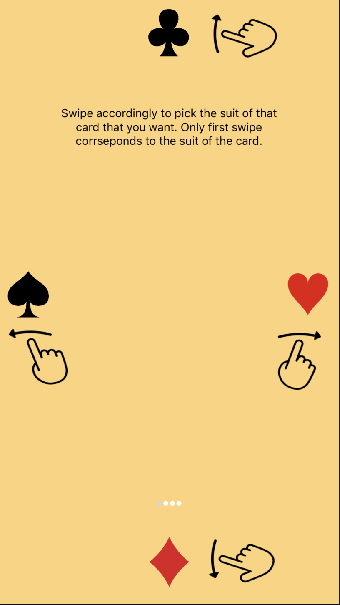
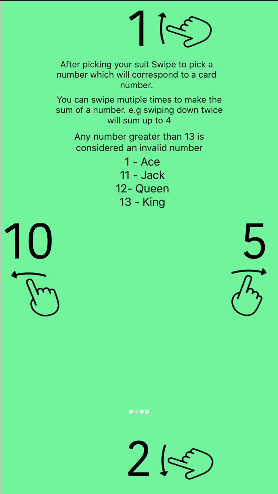
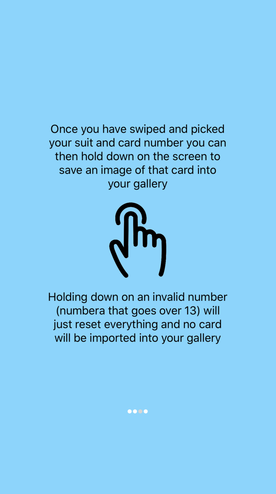
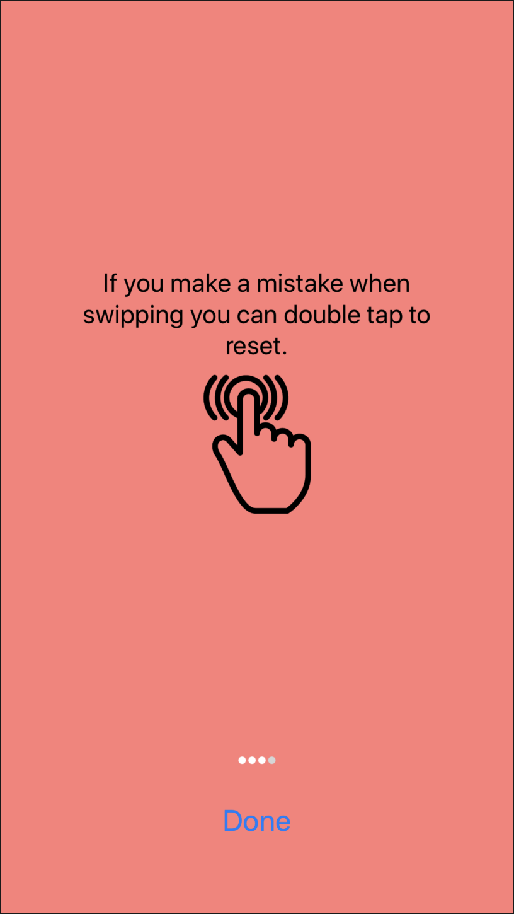

# CardTrick

Using finger gestures, the user can specifiy what card they want and an image of that card will be saved into the phones photo gallery.
 This is done with a black screen, giving the illusion that the phone is off.  The idea is to use it as a magic trick app where a user can have someone think/pick a card and make it look like that card is stored on the users gallery.

 
 

<h1 align="center" > Walkthrough</h1>

 
 

 
 

